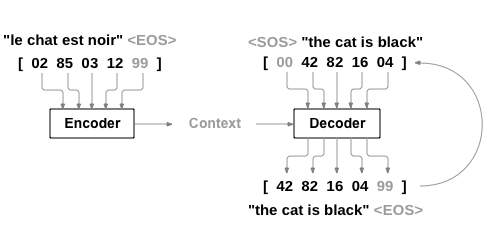
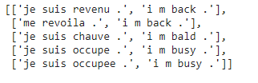
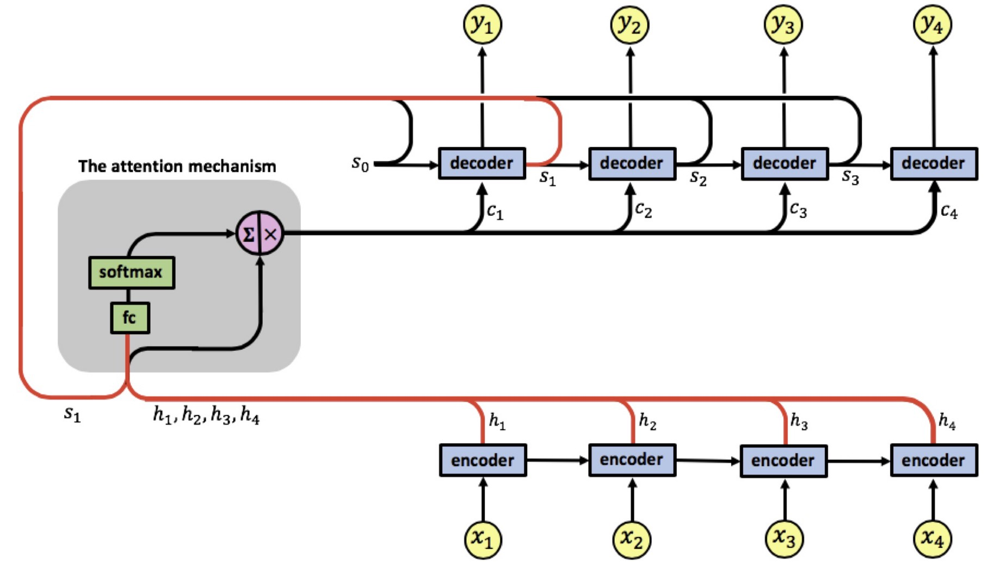

# NLP From Scratch: Translation With A Sequence To Sequence Network And Attention

> by Krishna N Revi 

## Assignment ❔

1. Follow the similar strategy as we did in our [baby-steps-code (Links to an external site.)](https://colab.research.google.com/drive/1IlorkvXhZgmd_sayOVx4bC_I5Qpdzxk_?usp=sharing), but replace GRU with LSTM. In your code you must:
   1. Perform 1 full feed forward step for the encoder **manually**
   2. Perform 1 full feed forward step for the decoder **manually**.
   3. You can use any of the 3 attention mechanisms that we discussed. 
2. Explain your steps in the readme file and
3. Submit the assignment asking for these things:
   1. Link to the readme file that must explain Encoder/Decoder Feed-forward manual steps **and the attention mechanism that you have used** - 500 pts
   2. Copy-paste (don't redirect to github), the Encoder Feed Forward steps for 2 words - 250 pts
   3. Copy-paste (don't redirect to github), the Decoder Feed Forward steps for 2 words - 250 pts

## Solution 💡

Please refer to complete solution  [here](https://github.com/krishnarevi/TSAI_END2.0_Session11/blob/main/NLP%20From%20Scratch%20Translation%20With%20A%20Sequence%20To%20Sequence%20Network%20And%20Attention.ipynb)

### Task 

In this task we will be teaching a neural network to translate from French to English.

```
[KEY: > input, = target, < output]

> il est en train de peindre un tableau .
= he is painting a picture .
< he is painting a picture .

> pourquoi ne pas essayer ce vin delicieux ?
= why not try that delicious wine ?
< why not try that delicious wine ?

> elle n est pas poete mais romanciere .
= she is not a poet but a novelist .
< she not not a poet but a novelist .

> vous etes trop maigre .
= you re too skinny .
< you re all alone .
```

This is made possible by the simple but powerful idea of the [sequence to sequence network](https://arxiv.org/abs/1409.3215), in which two recurrent neural networks work together to transform one sequence to another. An encoder network condenses an input sequence into a vector, and a decoder network unfolds that vector into a new sequence.



### Steps

**Data loading and preprocessing** 

We download French - English translation pair dataset from Pytorch official website [https://download.pytorch.org/tutorial/data.zip.](https://download.pytorch.org/tutorial/data.zip.)  Original dataset has 135842 sentence pairs. We trim dataset for easier training into 10599 sentence pairs . Final dataset has  4345 unique French words and  2803 unique English words. Sample data looks as follows :



**The architecture we are building**



As we can see here, we will have an encoder, an attention mechanism block and decoder. In the final code the attention mechanism block and decoder will be merged into single block as we need both to work together.

As we can see here, we need to create a copy of h1, h2, h3 and h4. These are encoder outputs for a sentence with 4 words.

**Encoder**

We will build our encoder with a LSTM. 

We can't feed our input directly to LSTM, we need to tensorize it, convert to embeddings first.

We will start from a sample sentence pair from our dataset

```python
sample = random.choice(pairs)
sample
```

*sample = ['je ne vais pas jouer a ce jeu .', 'i m not going to play this game .']*

Before feeding into encoder embedding layer, we will tokenize input sentence, convert into indices , append <EOS> token and convert into tensors.

```python
input_sentence = sample[0]
output_sentence = sample[1]
input_indices = [input_lang.word2index[x] for x in input_sentence.split(' ')]
output_indices = [output_lang.word2index[x] for x in output_sentence.split(' ')]
input_indices.append(EOS_token)
output_indices.append(EOS_token)
input_tensor =torch.tensor(input_indices,dtype=torch.long ,device=device)
output_tensor = torch.tensor(output_indices,dtype=torch.long,device=device)
```

*input_tensor = (tensor([   6,  297,    7,  246, 2194,  115,  528, 2568,    5,    1],        device='cuda:0'),* 

*output_tensor =tensor([   2,    3,  147,   61,  532, 2070,  797, 1519,    4,    1],        device='cuda:0'))*

Let's build our encoder now .The encoder of a seq2seq network is a LSTM that outputs some value for every word from the input sentence. For every input word the encoder outputs a output vector , a hidden state and cell state .Encoder uses the hidden state and cell state for the next input word.

First we will initialize  encoder hidden state and encoder cell state with zero tensor . All we need finally is the list of outputs. Let's create an empty tensor to store them as well. 

When we use encoder class from Pytorch it will internally handle for loop for us , but here as we are writing from scratch we need to define for loop explicitly to loop through multiple words in our input sentence .

```python

encoder_hidden,encoder_cell = torch.zeros((1,1,256),device=device), torch.zeros((1,1,256),device=device) # initialize encoder hidden and cell state with zero tensor
encoder_outputs = torch.zeros(MAX_LENGTH, 256, device=device)


for i in range(input_tensor.shape[0]) :
    embedded_input = embedding(input_tensor[i].view(-1, 1))
    output, (encoder_hidden,encoder_cell) = lstm(embedded_input, (encoder_hidden,encoder_cell))
    encoder_outputs[i] += output[0,0]

    print('\033[1m' +"Time step {}  \033[0m".format(i))
    if (i<input_tensor.shape[0]-1):
      print('Actual input word = {}'.format(input_sentence.split(" ")[i]))
    else:
      print('Actual input word = {}'.format("<EOS>"))
    print('Embedding of input word {} = {}'.format(i, output[0,0]))
    print('Encoder output at this time step = {}'.format(output[0,0]))

```

Next let's build out Decoder where we have attention in-built.

**Decoder**
